# 🎓 University Housing Management System

A lightweight web application built with **PHP, MySQL, HTML, CSS, and JavaScript** for managing university housing operations.  
It helps administrators handle residents, rooms, allocations, and occupancy tracking through a simple and structured interface.

---

## 🧩 Project Overview

| File / Folder | Purpose |
|---------------|---------|
| `index.php` | Main entry point of the application |
| `config/` | Database connection and app configuration |
| `includes/` | Reusable helper functions and shared logic |
| `admin/` | Admin-side pages and management features |
| `assets/` | CSS, JavaScript, and static resources |
| SQL file | Database schema and initial data |

---

## ⚡ Quick Start

Clone or download the project, place it inside your local server directory, import the SQL database, then open it in your browser.

Example repository format:

```bash
git clone https://github.com/zayynabz/university-housing-management-system.git
cd university-housing-management-system
```

Runs locally with **XAMPP**.

---

## ✨ Features

- 🔐 User authentication system
- 👨‍💼 Administrator management
- 🧑‍🎓 Resident management
- 🛏️ Room management
- 🏷️ Room allocation tracking
- 📊 Occupancy overview
- 💳 Administrative payment status tracking
- 🧭 Dashboard for quick access to core operations
- ♻️ Reusable PHP structure for easier maintenance

---
## 📸 Application Preview

### 🔐 Login Page
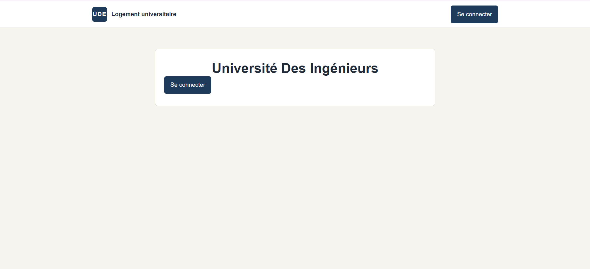
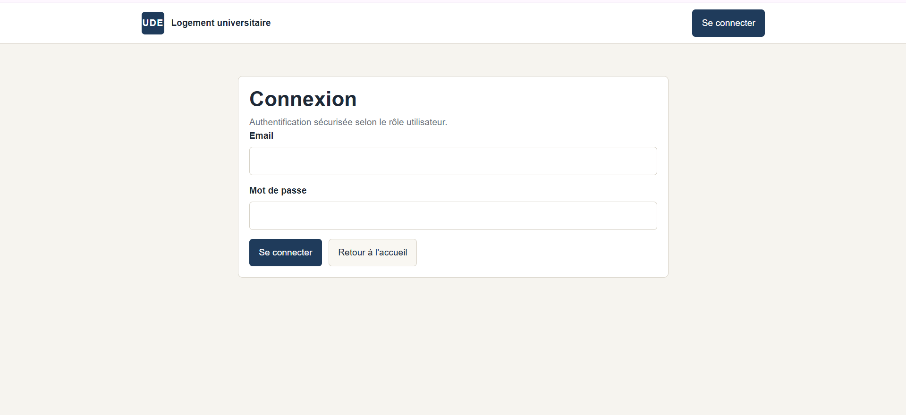

### 🧭  Admin
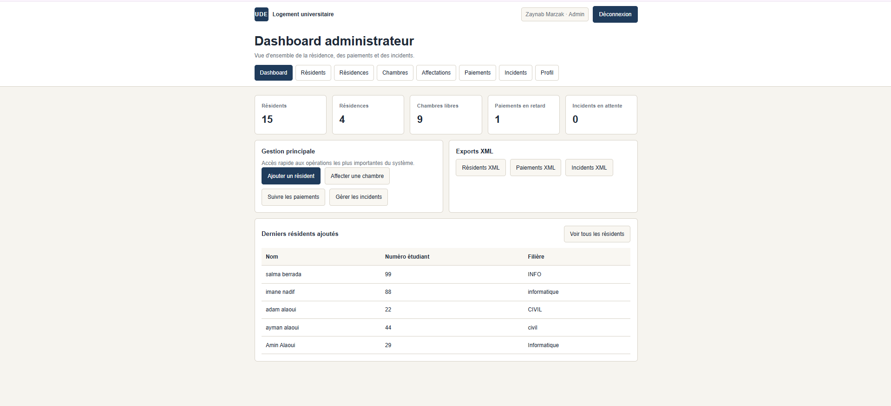
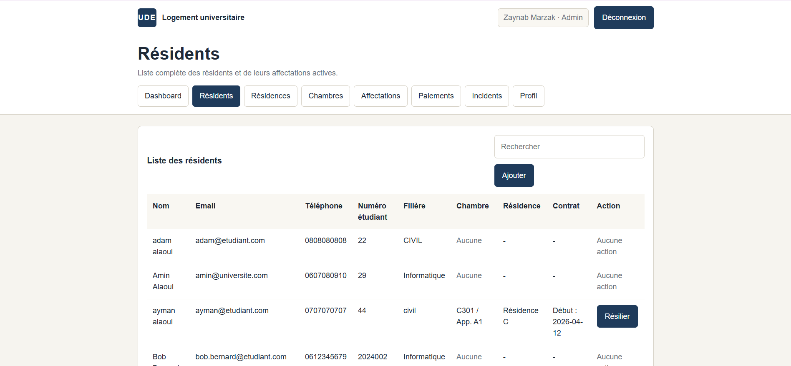
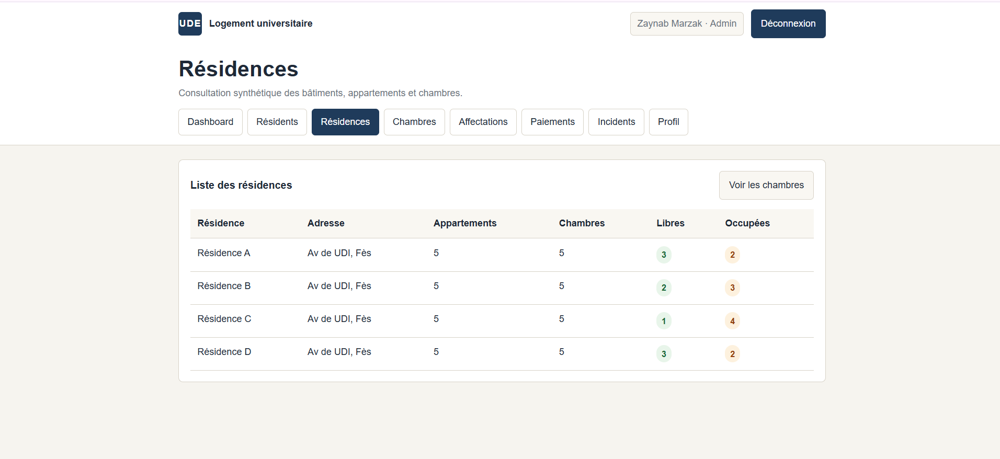
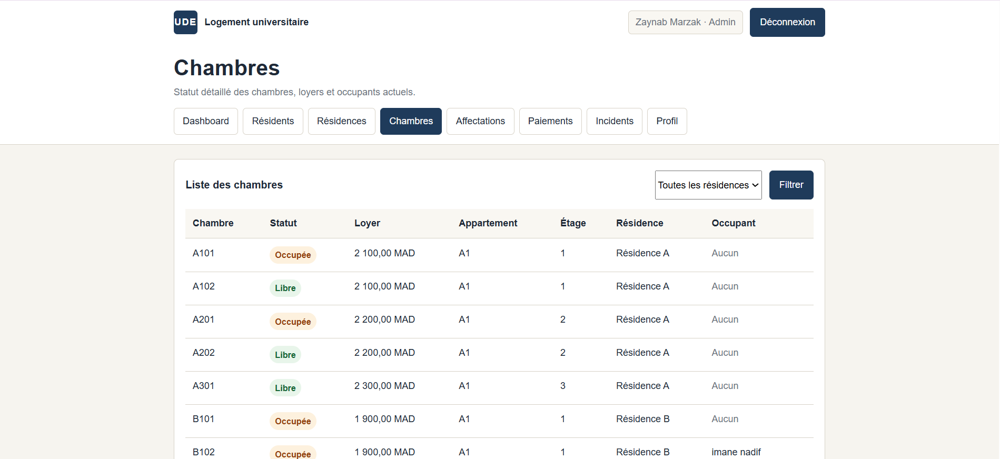
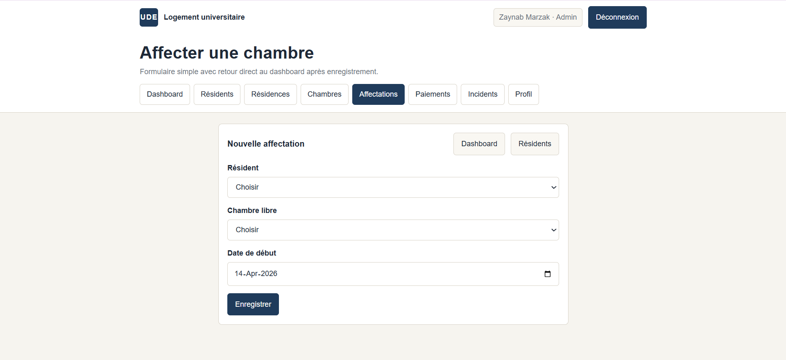
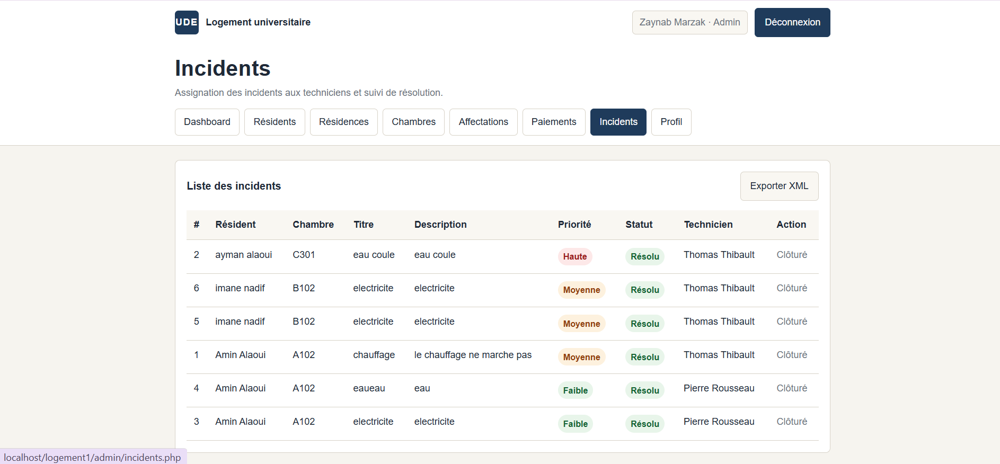

### 🧑‍🎓 Resident 
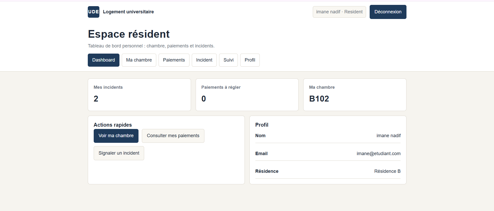
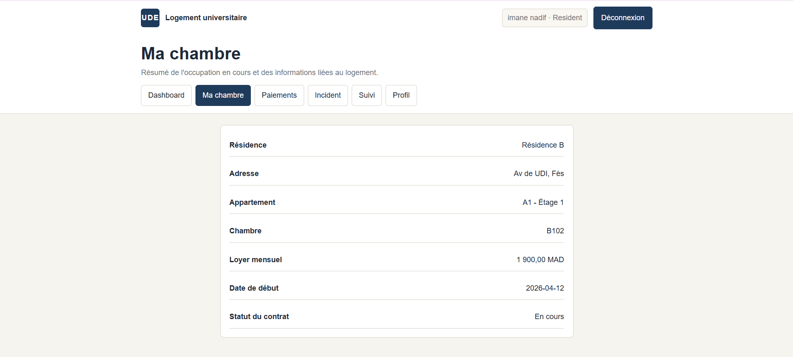


### 🛏️ Maintenance 
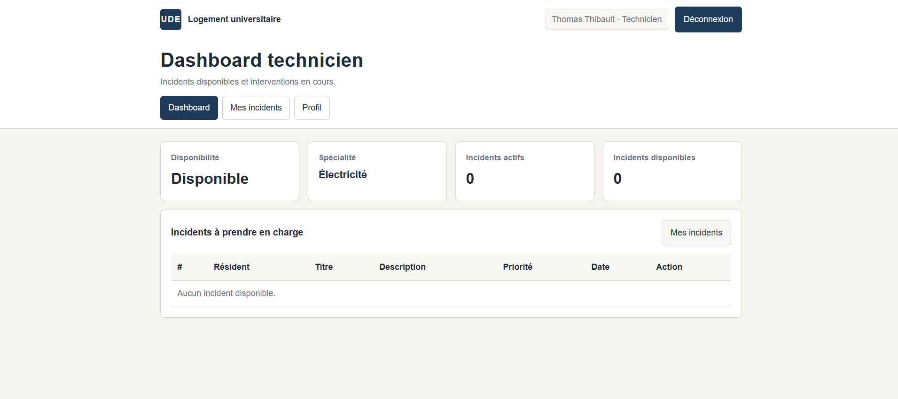
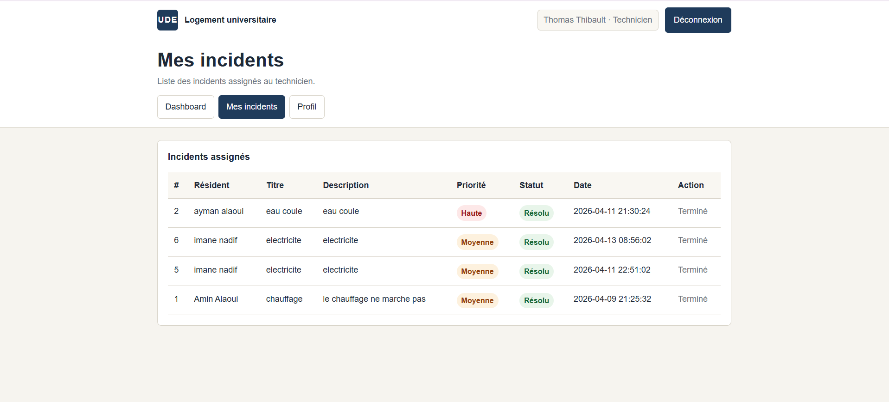


## 🧭 How It Works

1. Log in as an administrator  
2. Access the dashboard  
3. Manage residents and room records  
4. Assign rooms to residents  
5. Monitor room occupancy and housing data  
6. Update administrative payment status when needed  

---

## 🛠️ Tech Stack

- **Frontend:** HTML, CSS, JavaScript, XML
- **Backend:** PHP
- **Database:** MySQL
- **Environment:** XAMPP 

---

## 📦 Installation

### 1. Clone the repository

```bash
git clone https://github.com/zayynabz/university-housing-management-system.git
cd university-housing-management-system
```

### 2. Move the project into your local server directory

Examples:

- `htdocs/` for **XAMPP**
- `www/` for **WAMP**
- `C:\laragon\www\` for **Laragon**

### 3. Create the database

- Open **phpMyAdmin**
- Create a new database
- Import the provided SQL file

### 4. Configure database access

Update your database credentials in the configuration file.

This project also supports portable configuration using environment variables such as:

- `DB_HOST`
- `DB_NAME`
- `DB_USER`
- `DB_PASS`
- `DB_CHARSET`
- `APP_BASE_PATH`

### 5. Launch the app

Start **Apache** and **MySQL**, then open the project in your browser.

Example:

```bash
http://localhost/university-housing-management-system
```

If your local folder has a different name, use that instead.

---

## 🌍 Portability Notes

This version was adjusted to be easier to share and run on different machines:

- safer and more reliable PHP includes
- fewer machine-specific path assumptions
- cleaner base path handling
- improved portability for local deployment

That makes it more suitable for GitHub publication and team use.

---

## 🔒 Authentication Notes

Access depends on the accounts stored in the imported database.

After importing the SQL file, you can:

- log in using an existing admin account
- or manually insert a new admin account into the database if needed

---

## 💳 Payment Note

This project **does not implement real online payment integration**.

It only manages the **payment status** as part of the internal administrative workflow.

---

## 🧪 Testing Checklist

| Test | What to Check |
|------|---------------|
| Login | Admin authentication works correctly |
| Resident management | Add, edit, and view resident records |
| Room management | Add and update room information |
| Allocation flow | Assign rooms without broken navigation |
| Occupancy data | Room status updates correctly |
| Payment status | Administrative status displays properly |

---

## 🧰 Troubleshooting

### ❌ Database connection error?

- Check your MySQL credentials
- Confirm the database was created successfully
- Verify the SQL file was imported correctly

### ❌ Page paths not working?

- Make sure the project folder is placed correctly inside your local server directory
- Check your base URL in the browser
- Verify Apache path configuration if needed

### ❌ Admin login not working?

- Confirm the admin record exists in the database
- Check password storage format and table data
- Review PHP session and authentication logic

---

## 🚀 Possible Improvements

- online payment integration
- better role and permission management
- PDF / Excel export
- notifications and alerts
- advanced dashboard analytics
- stronger validation and security layers
- cleaner responsive UI refinements

---

## 🤝 Contributing

Contributions are welcome, especially in:

- UI/UX improvements
- validation and security enhancements
- better navigation flow
- code refactoring and modularization
- reporting and export features

---

## 📄 License

This project was developed for **academic and educational purposes**.

You may adapt or extend it for learning and demonstration use.

---

   **❤️ Made with love: Zaynab**

